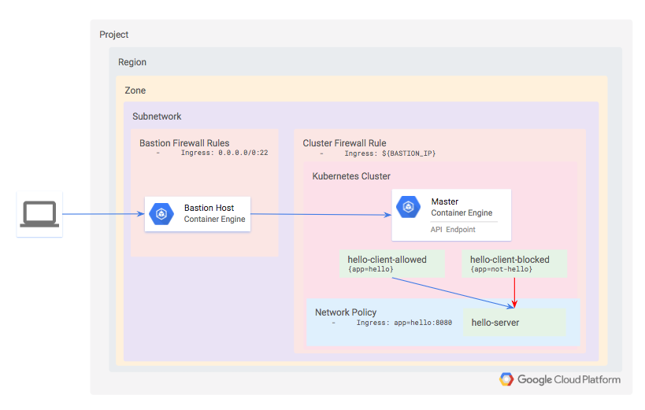

# How to use a Network Policy in Kubernetes Engine

## Table of Contents

<!-- TOC -->

  * [Introduction](#introduction)
  * [Architecture](#architecture)
  * [Initialize GCP Authorization](#initialize-gcp-authorization)
  * [Deplyment steps](#deplyment-steps)
     * [Setup this project](#setup-this-project)
     * [Provisioning the Kubernetes Engine Cluster](#provisioning-the-kubernetes-engine-cluster)
  * [Validation](#validation)
  * [Installing the hello server](#installing-the-hello-server)
  * [Confirming default access to the hello server](#confirming-default-access-to-the-hello-server)
  * [Restricting access with a Network Policy](#restricting-access-with-a-network-policy)
  * [Restricting namespaces with Network Policies](#restricting-namespaces-with-network-policies)
  * [Validation](#validation-1)
  * [Tear Down](#tear-down)
  * [Troubleshooting](#troubleshooting)
     * [The install script fails with a Permission denied when running Terraform](#the-install-script-fails-with-a-permission-denied-when-running-terraform)
     * [Invalid fingerprint error during Terraform operations](#invalid-fingerprint-error-during-terraform-operations)
  * [Relevant Material](#relevant-material)

<!-- TOC -->

## Introduction

This guide demonstrates how to improve the security of your Kubernetes Engine by applying fine-grained restrictions to network communication.

The Principle of Least Privilege is widely recognized as an important design consideration in enhancing the protection of critical systems from faults and malicious behavior (https://en.wikipedia.org/wiki/Principle_of_least_privilege). It suggests that every component must be able to access **only** the information and resources that are necessary for its legitimate purpose. This document demonstrates how the Principle of Least Privilege can be implemented within the Kubernetes Engine network layer.

Network connections can be restricted at two tiers of your Kubernetes Engine infrastructure. The first, and coarser grained, mechanism is the application of Firewall Rules at the Network, Subnetwork, and Host levels. These rules are applied outside of the Kubernetes Engine at the VPC level.

While Firewall Rules are a powerful security measure, Kubernetes enables us to define even finer grained rules via Network Policies. [Network Policies](https://kubernetes.io/docs/concepts/services-networking/network-policies/) are used to limit intra-cluster communication. Note that network policies do not apply to pods attached to the host's network namespace.

The steps below will provision a private Kubernetes Engine cluster and a bastion host with which to access it. A bastion host provides a single host that has access to the cluster, which, when combined with a private kubernetes network ensures that the cluster isn't exposed to malicious behavior from the internet at large. Bastions are particularly useful when you do not have VPN access to the cloud network.

Within the cluster, a simple HTTP server and two client pods will be provisioned. This tutorial will then demonstrate how to use a Network Policy and labeling to only allow connections from one of the client pods.

## Architecture

For demonstration purposes, you will define a private Kubernetes cluster. Since the cluster is private, neither the API nor the worker nodes will be accessible from the internet. Instead, you will define a bastion host and use a firewall rule to enable access to it. The bastion's IP address is defined as an authorized network for the cluster, which grants it access to the API.

Within the cluster, provision three workloads:

1. hello-server: this is a simple HTTP server with an internally-accessible endpoint
1. hello-client-allowed: this is a single pod that repeatedly attempts to access hello-server. The pod is labeled such that the Network Policy will allow it to connect to hello-server.
1. hello-client-blocked: this runs the same code as hello-client-allowed but the pod is labeled such that the Network Policy will __not__ allow it to connect to hello-server.




## Initialize GCP Authorization

When using Cloud Shell execute the following command in order to setup gcloud cli.

```console
gcloud init
```

## Deplyment steps

The following steps will allow a user to run the demo.

### Setup this project

This project requires the following Google Cloud Service APIs to be enabled:

* `compute.googleapis.com`
* `container.googleapis.com`
* `cloudbuild.googleapis.com`

In addition, the terraform configuration takes three parameters to determine where the Kubernetes Engine cluster should be created:

* `project`
* `region`
* `zone`

For simplicity, these parameters are to be specified in a file named `terraform.tfvars`, in the `terraform` directory. To ensure the appropriate APIs are enabled and to generate the `terraform/terraform.tfvars` file based on your gcloud defaults, run:

```console
make setup-project
```

This will enable the necessary Service APIs, and it will also generate a `terraform/terraform.tfvars` file with the following keys. The values themselves will match the output of `gcloud config list`:

```console
cat terraform/terraform.tfvars

project="YOUR_PROJECT"
region="YOUR_REGION"
zone="YOUR_ZONE"
```

If you need to override any of the defaults, simply replace the desired value(s) to the right of the equals sign(s). Be sure your replacement values are still double-quoted.

### Provisioning the Kubernetes Engine Cluster

Next, apply the terraform configuration with:

```console
# From within the project root, use make to apply the terraform
make tf-apply
```

When prompted if you want to deploy the plan, review the generated plan and enter `yes` to deploy the environment.

## Validation

Once complete, terraform will output a message indicating successful creation of the cluster.

```console
...snip...
google_container_cluster.primary: Still creating... (3m0s elapsed)
google_container_cluster.primary: Still creating... (3m10s elapsed)
google_container_cluster.primary: Still creating... (3m20s elapsed)
google_container_cluster.primary: Still creating... (3m30s elapsed)
google_container_cluster.primary: Creation complete after 3m34s (ID: gke-demo-cluster)

Apply complete! Resources: 5 added, 0 changed, 0 destroyed.
```

You can also confirm the cluster was created successfully by ensuring that Network Policies are enabled for the new cluster. Verify that `networkPolicyConfig.disabled` is `false` and `networkPolicy.provider` is `CALICO`.

```console
gcloud container clusters describe gke-demo-cluster | grep  -A1 networkPolicy
  networkPolicyConfig:
    disabled: true
--
networkPolicy:
  provider: CALICO

```

Now ssh into the bastion for the remaining steps.

```console
gcloud compute ssh gke-demo-bastion
```

The newly-created cluster will now be available for the standard `kubectl` commands on the bastion.

## Installing the hello server

The test application consists of one simple HTTP server, deployed as hello-server and two clients, one of which will be labeled as app=hello and the other app=not-hello.

All three services can be deployed by applying the hello-app manifests. On the bastion, run:

```console
kubectl apply -f ./manifests/hello-app/

deployment.apps/hello-client-allowed created
deployment.apps/hello-client-blocked created
service/hello-server created
deployment.apps/hello-server created
```

Use `kubectl get pods`` to verify all three pods have been successfully deployed.
You will see one running pod for each of *hello-client-allowed*, *hello-client-blocked*,
and *hello-server* deployments.

```console
kubectl get pods
NAME                                      READY     STATUS    RESTARTS   AGE
hello-client-allowed-7d95fcd5d9-t8fsk   |  1/1      Running   0          14m
hello-client-blocked-6497db465d-ckbn8   |  1/1      Running   0          14m
hello-server-7df58f7fb5-nvcvd           |  1/1      Running   0          14m
```

## Confirming default access to the hello server

Open two new terminals and ssh into the bastion on both using the command:

```console
gcloud compute ssh gke-demo-bastion
```

Tail the logs for the clients in each console:

In the first of the two newly created terminals, tail the "allowed" client:

```console
kubectl logs --tail 10 -f $(kubectl get pods -oname -l app=hello)
```

In the second newly created terminal, tail the logs of the "blocked" client:

```console
kubectl logs --tail 10 -f $(kubectl get pods -oname -l app=not-hello)
```

You will notice that both pods are successfully able to connect to the `hello-server` service. This is because you have not yet defined a Network Policy to restrict access. In each of these windows you should see successful responses from the server.

```console
Hostname: hello-server-7df58f7fb5-nvcvd
Hello, world!
Version: 1.0.0
Hostname: hello-server-7df58f7fb5-nvcvd
Hello, world!
Version: 1.0.0
Hostname: hello-server-7df58f7fb5-nvcvd
...
```

## Restricting access with a Network Policy

In this step you will block access to the `hello-server` pod from all pods that are not labeled with `app=hello`.

The policy definition you'll use is contained in `manifests/network-policy.yaml`

Apply the policy with the following command:

```console
kubectl apply -f ./manifests/network-policy.yaml

networkpolicy.networking.k8s.io/hello-server-allow-from-hello-client created
```

You'll now see that the output looks like this in the window tailing the "blocked" client:

```console
wget: download timed out
wget: download timed out
wget: download timed out
wget: download timed out
wget: download timed out
wget: download timed out
wget: download timed out
wget: download timed out
wget: download timed out
...
```

Indicating that the network policy has now prevented communication to the `hello-server` from the unlabeled pod.

## Restricting namespaces with Network Policies

In the previous example, you defined a network policy that restricts connections based on pod labels. It is often useful to instead label entire namespaces, particularly when teams or applications are granted their own namespaces.

You'll now modify the network policy to only allow traffic from a designated namespace, then you'll move the `hello-allowed` pod into that new namespace.

First, delete the existing network policy and create the namespaced version

```console
kubectl delete -f ./manifests/network-policy.yaml

networkpolicy.networking.k8s.io "hello-server-allow-from-hello-client" deleted
```

```console
kubectl create -f ./manifests/network-policy-namespaced.yaml

networkpolicy.networking.k8s.io/hello-server-allow-from-hello-client created
```

Now observe the logs of the `hello-allowed-client` pod in the default namespace. You will notice it is no longer able to connect to the `hello-server`.

Finally, deploy a second copy of the hello-clients app into the new namespace.

```console
kubectl -n hello-apps apply -f ./manifests/hello-app/hello-client.yaml

deployment.apps/hello-client-allowed created
deployment.apps/hello-client-blocked created
```

## Validation

Check the logs for the two new `hello-app` clients and you will see that both clients are able to connect successfully. This is because, *as of Kubernetes 1.10.x NetworkPolicies do not support restricting access to pods within a given namespace*. You can whitelist by pod label, namespace label, or whitelist the union (ie OR) of both. But you cannot yet whitelist the intersection (ie AND) of pod labels and namespace labels.

View the logs for the "hello"-labeled app in the app in the `hello-apps` namespace:

```console
kubectl logs --tail 10 -f -n hello-apps $(kubectl get pods -oname -l app=hello -n hello-apps)

Hostname: hello-server-6c6fd59cc9-7fvgp
Hello, world!
Version: 1.0.0
Hostname: hello-server-6c6fd59cc9-7fvgp
Hello, world!
Version: 1.0.0
Hostname: hello-server-6c6fd59cc9-7fvgp
Hello, world!
Version: 1.0.0
Hostname: hello-server-6c6fd59cc9-7fvgp
Hello, world!
Version: 1.0.0
Hostname: hello-server-6c6fd59cc9-7fvgp
```

## Tear Down

Log out of the bastion host and run the following to destroy the environment:

```console
make teardown

...snip...
google_compute_subnetwork.cluster-subnet: Still destroying... (ID: us-east1/kube-net-subnet, 20s elapsed)
google_compute_subnetwork.cluster-subnet: Destruction complete after 25s
google_compute_network.gke-network: Destroying... (ID: kube-net)
google_compute_network.gke-network: Still destroying... (ID: kube-net, 10s elapsed)
google_compute_network.gke-network: Still destroying... (ID: kube-net, 20s elapsed)
google_compute_network.gke-network: Destruction complete after 26s

Destroy complete! Resources: 5 destroyed.
```

## Troubleshooting

### The install script fails with a `Permission denied` when running Terraform

The credentials that Terraform is using do not provide the necessary permissions to create resources in the selected projects. Ensure that the account listed in `gcloud config list` has necessary permissions to create resources. If it does, regenerate the application default credentials using `gcloud auth application-default login`.

### Invalid fingerprint error during Terraform operations

Terraform occasionally complains about an invalid fingerprint, when updating certain resources. If you see the error below, simply re-run the command. 

## Relevant Material

* [Terraform Google Provider](https://www.terraform.io/docs/providers/google/)
* [Kubernetes Network Policies](https://kubernetes.io/docs/concepts/services-networking/network-policies/)
* [Kubernetes Engine - Creating a Cluster Network Policy](https://cloud.google.com/kubernetes-engine/docs/how-to/network-policy)
* [Kubernetes Engine - Network Policy Tutorial](https://cloud.google.com/kubernetes-engine/docs/tutorials/network-policy)
* [Kubernetes Engine - Hardening your cluster's security](https://cloud.google.com/kubernetes-engine/docs/how-to/hardening-your-cluster)

**This is not an officially supported Google product**
